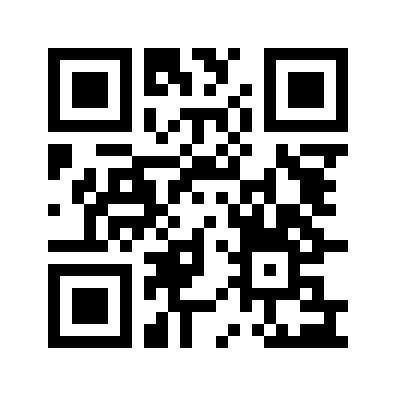

# Mở bản Review trong app trên điện thoại

App chạy trong Expo Go, dùng giao diện React Native và API Review trên máy tính. Chưa có IPA/APK cài riêng; thông báo thật đang tắt. Dự án dùng Expo SDK 57. [Expo Go hiện hỗ trợ SDK 57](https://expo.dev/go); iPhone cần iOS 16.4 trở lên theo [bảng hỗ trợ SDK](https://docs.expo.dev/versions/v57.0.0/).

## 1. Cài Expo Go trên điện thoại

Cài/cập nhật **Expo Go** từ App Store trên iPhone hoặc Google Play trên Samsung. Trang tải chính thức: https://expo.dev/go.

Kết nối điện thoại vào mạng nội bộ truy cập được máy tính `172.20.235.186`. Máy tính hiện kết nối bằng Ethernet; Wi-Fi điện thoại cần cho phép truy cập cùng mạng này.

## 2. Đăng nhập Expo để mở trên iPhone

Theo [hướng dẫn Expo](https://docs.expo.dev/get-started/start-developing/), Expo Go trên iPhone thật yêu cầu đăng nhập cùng một tài khoản Expo trên máy tính và điện thoại.

Trong terminal VS Code, bạn tự đăng nhập:

```powershell
cd D:\MEC-Care\apps\mobile
npx expo login
```

Trong Expo Go trên iPhone, mở biểu tượng tài khoản và đăng nhập **cùng tài khoản Expo**. Nếu chưa có, tạo tài khoản Expo miễn phí trên trang chính thức. Không dùng tài khoản SQL hoặc tài khoản mẫu của Clienté cho bước này. Không gửi mật khẩu Expo trong chat.

## 3. Chạy API và server app

Nếu hai server đang chạy sẵn, API có thể tiếp tục chạy. Sau khi đăng nhập Expo, khởi động lại server Expo để lấy thông tin đăng nhập mới. Nhấn Ctrl+C trong terminal Expo đang chạy trước khi chạy lại, tránh trùng cổng 8081.

Terminal 1 — API (nếu chưa chạy):

```powershell
cd D:\MEC-Care
dotnet run --project apps/api --launch-profile review
```

Terminal 2 — app native:

```powershell
cd D:\MEC-Care
.\scripts\start-review-mobile.ps1 -Phone -ApiHost 172.20.235.186
```

Giữ hai terminal mở. Terminal app hiển thị QR và dòng `Metro waiting on exp://172.20.235.186:8081`; chế độ phải là **Expo Go**.

Nếu script bị chặn bởi execution policy, dùng tiến trình riêng:

```powershell
powershell -NoProfile -ExecutionPolicy Bypass -File .\scripts\start-review-mobile.ps1 -Phone -ApiHost 172.20.235.186
```

## 4. Quét QR mở app

- **iPhone:** mở Camera, quét QR trong terminal hoặc ảnh bên dưới, chạm mở bằng Expo Go. Nếu Expo Go hỏi quyền truy cập mạng cục bộ, cho phép để kết nối máy tính.
- **Samsung:** mở Expo Go → Scan QR code, quét QR. Nếu phiên bản Expo Go có ô nhập URL, có thể nhập `exp://172.20.235.186:8081`.



QR tương ứng `exp://172.20.235.186:8081`; chỉ dùng khi IP và cổng vẫn đúng. Khi IP máy tính thay đổi, truyền IP mới vào `-ApiHost` và quét QR mới trong terminal.

Khi thấy màn hình **Clienté** có nhãn **REVIEW**, đăng nhập:

```text
Email: review@clientstudio.local
Mật khẩu: Review123!
```

Tài khoản thứ hai là `review2@clientstudio.local`, cùng mật khẩu thử, có dữ liệu riêng. Hồ sơ thử được giữ lại trong SQLite trên máy tính khi khởi động lại.

## Nếu chưa mở được

- Báo chưa đăng nhập hoặc sai tài khoản Expo trên iPhone: đăng nhập cùng tài khoản ở hai nơi, chạy lại server app rồi quét QR mới.
- Báo không tương thích SDK: cập nhật Expo Go. Dự án yêu cầu SDK 57; không tự đổi SDK để xử lý lỗi.
- Không tải được app: trên điện thoại thử mở `http://172.20.235.186:5180/health`, phải trả `mode: review`. Đây chỉ là phép kiểm tra kết nối API. Kiểm tra thêm cổng 8081, mạng khách cách ly và Windows Firewall nếu cần.
- App mở nhưng không đăng nhập được: kiểm tra API còn chạy và IP `-ApiHost` đúng. Expo tunnel chỉ đưa Metro ra ngoài; không tự làm API cục bộ truy cập được, vì vậy không dùng tunnel để thay thế việc kết nối API trong hướng dẫn này.

Đã kiểm tra server phát manifest native và địa chỉ bundle đúng; cần bạn mở trên điện thoại thật để xác nhận giao diện, bàn phím và chọn ảnh. Bản Review không gửi push. Bản cài có biểu tượng riêng và thông báo đầy đủ cần development build, cấu hình ký Apple/Android và kiểm thử riêng.
